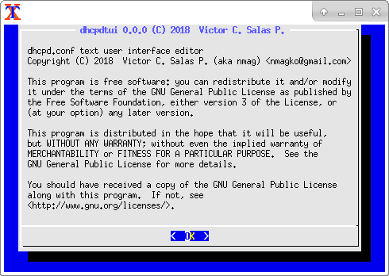
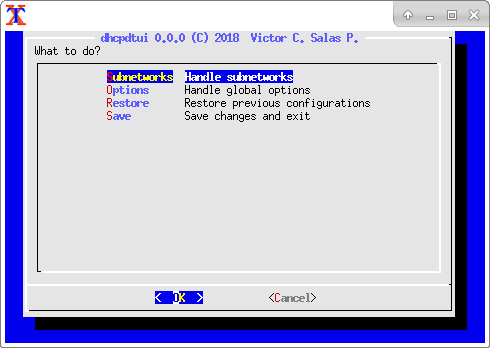

### DHCPD TEXT USER INTERFACE

Copyright (C) 2018 Victor C Salas (aka nmagko)

This program is free software; you can redistribute it and/or modify it
under the terms of the GNU Public License as published by the Free
Software Foundation; either version 3 of the license or (in your
opinion) any later version.

### WHAT IS DHCPDTUI?



DHCPDTUI is a small program compatible with the ISC-DHCP server and you
can easily handle dhcpd.conf file.

It was written in C and it gives you an interface dialog based.

### WHAT CAN YOU DO?



- Handle Subnetworks.

- Static IP host assignment by MAC address.

- Define IP ranges.

- Set global options and subnetwork options like gateway, DNS, etc.

- Automatic dhcpd.conf backup and restore option.

### DEPENDS ON

- make

- gcc

- ncursesw

- dialog

- uregex [1]

### PROVIDES

- dhcpdtui: main executable

### HOW TO COMPILE AND INSTALL

As root go to the dhcpdtui folder, so you have to execute the:

```
make
make install
```

### REFERENCES

[1] liburegex, https://savannah.gnu.org/projects/liburegex/

P.S.

Write me an email if you have any questions, please use American English
or Spanish, I will reply to you when I get time.

Victor C Salas (aka nmagko)

### FREE DOCUMENTATION LICENSE

Copyright (C) 2018 Victor C Salas

  Permission is granted to copy, distribute, and/or modify this document
  under the terms of the GNU Free Documentation License, Version 1.3 or
  any later version published by the Free Software Foundation; with no
  Invariant Sections, no Front-Cover Texts, and no Back-Cover Texts.  A
  copy of the license is included in the section entitled "GNU Free
  Documentation License."
